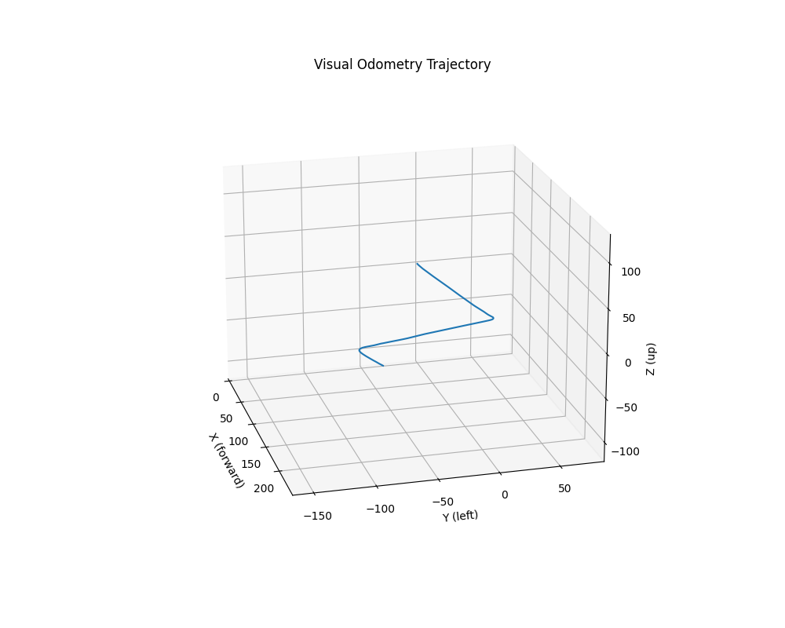

# Stereo Visual Odometry for KITTI Dataset

This project implements a **feature-based stereo Visual Odometry (VO)** system tailored for the [KITTI dataset](http://www.cvlibs.net/datasets/kitti/). It estimates vehicle motion from synchronized stereo images and reconstructs the camera trajectory and a sparse 3D map of the environment.



---

## 🚗 Dataset

**Drive used**: `2011_09_26_drive_0117_sync`  
**Calibration**: `2011_09_26/calib_cam_to_cam.txt`

---

## 📦 Directory Structure

```
SLAM/
├── 2011_09_26_drive_0117_sync/     # KITTI drive images
│   └── 2011_09_26/                 # Calibration files
├── config/
│   └── configuration.yaml          # Dataset and output path configuration
├── headers/                        # Abstract base classes (interfaces)
│   ├── DriverModule.py
│   ├── GraphModule.py
│   └── SLAMModule.py
├── src/                            # Core implementation
│   ├── Driver.py
│   ├── Graph.py
│   ├── SLAM.py
│   └── __init__.py
├── matches/                        # Stereo match visualizations
├── map/                            # Frame-wise SLAM map overlays
├── visual/                         # Saved top-down maps
├── run.py                          # Entry point to run the pipeline
├── trajectory_path.png             # Full trajectory visualization
└── SLAM_Report.pdf                 # Technical documentation
```

---

## 🧠 SLAM Pipeline

1. **Stereo Matching**
   - ORB keypoint detection (3000 features per frame)
   - Brute-Force matching + Epipolar constraint

2. **3D Mapping**
   - Stereo triangulation (OpenCV)
   - Depth filtering: 0.5m < Z < 100m

3. **Temporal Tracking**
   - Lucas-Kanade optical flow
   - Feature linkage for pose estimation

4. **Pose Estimation**
   - PnP with RANSAC
   - Skip frame if Δmotion < 0.2m

5. **Keyframe Selection**
   - Based on motion threshold and inlier count

---

## 📊 Results

| Visualization | Description |
|---------------|-------------|
|  | Top-down sparse map with trajectory at frame 638 |
|  | Stereo ORB feature matching |
|  | 3D vehicle trajectory |

---

## 🔧 How to Run

```bash
python run.py
```

Make sure to configure the dataset and output paths in `config/configuration.yaml`.

---

## 📌 Dependencies

- Python 3.8+
- OpenCV
- NumPy
- PyYAML
- Matplotlib

Install all dependencies using:

```bash
pip install -r requirements.txt
```

---

## 📄 Report

Full technical documentation available here: [SLAM_Report.pdf](SLAM_Report.pdf)